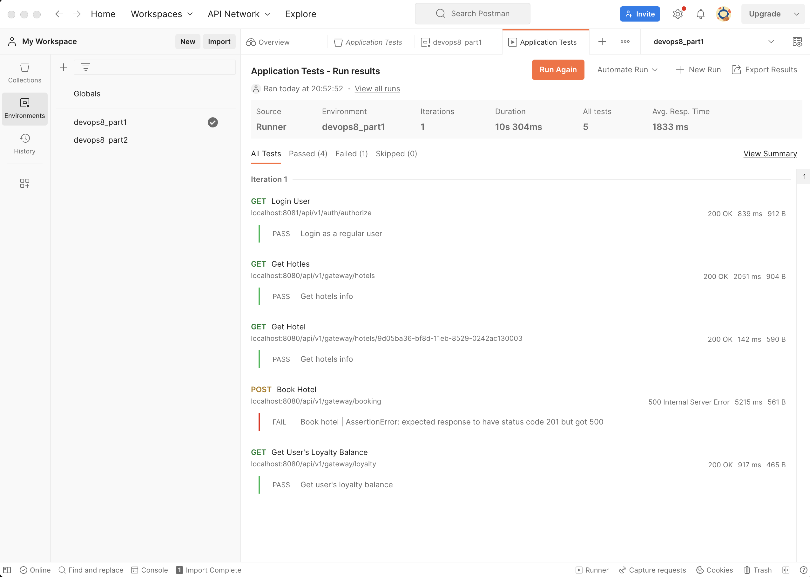
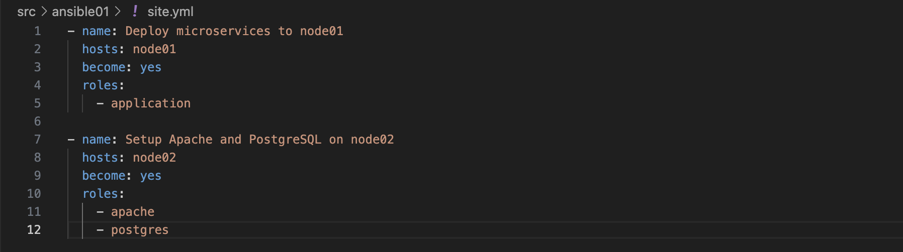
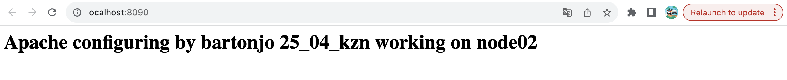
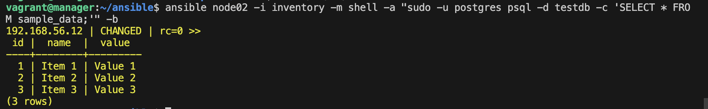
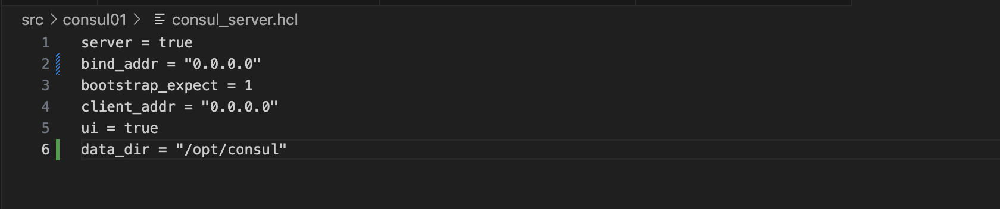
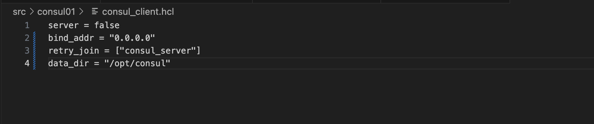
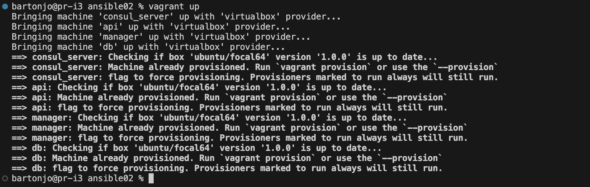
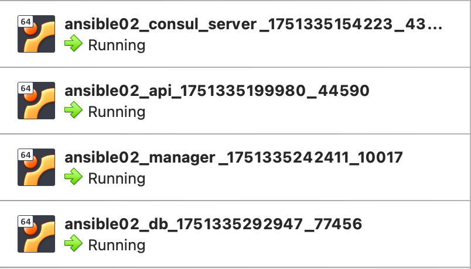
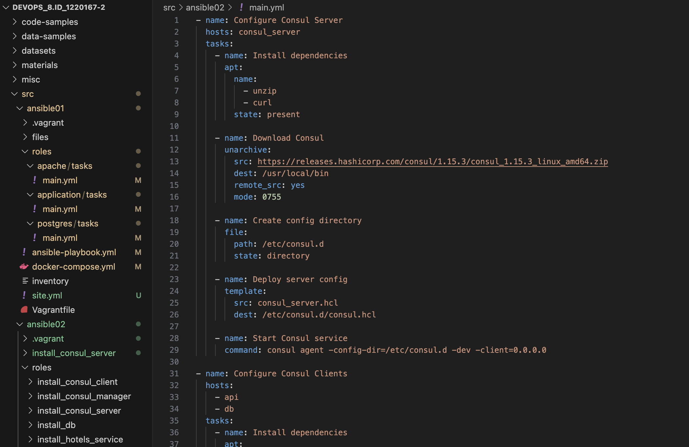

## Part 1. Удаленное конфигурирование узла через Ansible

### 1. Создание машин и проброс портов

- Создать с помощью Vagrant три машины - manager, node01, node02. Прокинуть порты node01 на локальную машину.
   ~/DevOps_8.ID_1220167-2/src/ansible01 % `vagrant init`

   ~/DevOps_8.ID_1220167-2/src/ansible01 % `vagrant up`

   ~/DevOps_8.ID_1220167-2/src/ansible01 % `vagrant status`

- Проверить, слушает ли Vagrant эти порты
   ~/DevOps_8.ID_1220167-2/src/ansible01 % `netstat -an | grep -E "\.8080|\.8081|\.8082|\.8500"`

- Проброшенные порты

- Проверка портов
   ~/DevOps_8.ID_1220167-2/src/ansible01 % `echo "Проверка портов:"; for port in 8080 8081 8082 8500; do nc -z 127.0.0.1 $port && echo "Порт $port открыт" || echo "Порт $port закрыт"; done`

### 2. Подготовка manager как рабочей станции

- Проверка подключения к node01
   bartonjo@pr-i3 ansible01 % `vagrant ssh manager`

   vagrant@manager:~$ `ssh vagrant@192.168.56.11`

- Сгенерировать SSH-ключ
   vagrant@manager:~$ `ssh-keygen -t rsa -b 4096 -f ~/.ssh/id_rsa -N ""`

- Копирование публичного ключа
   bartonjo@pr-i3 ansible01 % `vagrant ssh manager -c "cat ~/.ssh/id_rsa.pub" | vagrant ssh node01 -c "mkdir -p ~/.ssh && cat >> ~/.ssh/authorized_keys && chmod 600 ~/.ssh/authorized_keys"`

- Скопировать services
   bartonjo@pr-i3 ansible01 % `vagrant upload ../services /home/vagrant/ansible/files/src/services --machine manager`

- Скопировать yml
   bartonjo@pr-i3 ansible01 % `vagrant upload docker-compose.yml /home/vagrant/ansible/files/docker-compose.yml --machine manager`

- Установка Ansible на manager
   bartonjo@pr-i3 ansible01 % `vagrant ssh manager`

   vagrant@manager:~$ `sudo apt update`

   vagrant@manager:~$ `sudo apt install -y ansible`

- Создание inventory файла
   vagrant@manager:~$ `cat > inventory << EOF
   [nodes]
   node01 ansible_host=192.168.56.11 ansible_user=vagrant ansible_ssh_private_key_file=~/.ssh/id_rsa
   node02 ansible_host=192.168.56.12 ansible_user=vagrant ansible_ssh_private_key_file=~/.ssh/id_rsa
   [all:vars]
   ansible_ssh_common_args='-o StrictHostKeyChecking=no'
   EOF`

- Проверка подключения через Ansible к node01
   vagrant@manager:~$ `ansible all -i inventory -m ping`

### 3. Написание и выполнение плейбука Ansible

- Копирование плейбука на manager
   bartonjo@pr-i3 ansible01 % `tar -czf - ansible-playbook.yml | vagrant ssh manager -c "cd ~/ansible && tar -xzf -"`

- Проверка на виртуальной машине
   bartonjo@pr-i3 ansible01 % `vagrant ssh manager`
   `cd ~/ansible`
   `ls -la`

- Запуск плейбука
   bartonjo@pr-i3 ansible01 % `vagrant ssh manager -c "cd ~/ansible && ansible-playbook -i inventory ansible-playbook.yml -v"`

### 4. Тестирование через Postman

### 5. Создание и применение ролей Ansible

- Сформировать три роли:
  - application (развертывание приложения)
  - apache (установка Apache)
  - postgres (установка PostgreSQL)

- Плейбук для ролей

- Apache доступен на порту 8090:   
http://localhost:8090

- Проверка PostgreSQL:
vagrant@manager:~/ansible$ `ansible node02 -i inventory -m shell -a "sudo -u postgres psql -d testdb -c 'SELECT * FROM sample_data;'" -b`

## Part 2. Service Discovery с использованием Consul

### 1. Создание конфигурационных файлов Consul

### 2. Создание машин с помощью Vagrant

- Создать четыре машины - consul_server, api, manager и db

   bartonjo@pr-i3 ansible02 % `vagrant up`

### 3. Написание плейбука Ansible и ролей

- `install_consul_server` - установка Consul на сервер
- `install_consul_client` - установка Consul на клиенты
- `install_db` - установка PostgreSQL
- `install_hotels_service` - установка сервиса отелей

### 4. Проверка работоспособности

- Проверить CRUD-операции над сервисом отелей.

---
- Consul Server (192.168.60.10): 
   - Установлен и настроен Consul в режиме сервера
   - Запущен сервис Consul
---   
- API (192.168.60.11):
   - Установлен Consul в режиме клиента
   - Зарегистрирован сервис hotels-service
   - Установлен Java и сервис отелей
   - Сервис доступен на http://localhost:8082
---
- DB (192.168.60.13):
   - Установлен Consul в режиме клиента
   - Зарегистрирован сервис postgres
   - Установлена PostgreSQL с тестовой базой
   - Создана таблица hotels с тестовыми данными
---
- Manager (192.168.60.12):
   - UI Consul доступен на http://localhost:8500
   - Ansible управляет всей инфраструктурой
---