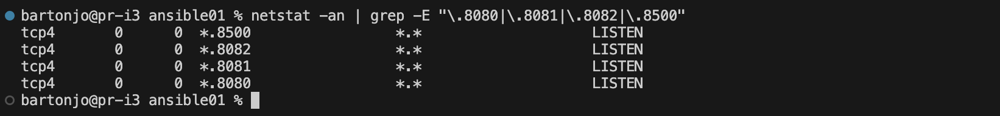

## Part 1. Удаленное конфигурирование узла через Ansible

### 1. Создание машин и проброс портов

- Создать с помощью Vagrant три машины - manager, node01, node02. Прокинуть порты node01 на локальную машину.
- ~/DevOps_8.ID_1220167-2/src/ansible01 % `vagrant init`

- ~/DevOps_8.ID_1220167-2/src/ansible01 % `vagrant up`


- ~/DevOps_8.ID_1220167-2/src/ansible01 % `vagrant status`


- Проверить, слушает ли Vagrant эти порты
~/DevOps_8.ID_1220167-2/src/ansible01 % `netstat -an | grep -E "\.8080|\.8081|\.8082|\.8500"`


- Проброшенные порты


- Проверка портов
~/DevOps_8.ID_1220167-2/src/ansible01 % `echo "Проверка портов:"; for port in 8080 8081 8082 8500; do nc -z 127.0.0.1 $port && echo "Порт $port открыт" || echo "Порт $port закрыт"; done`

---

### 2. Подготовка manager как рабочей станции

- Проверка подключения к node01
bartonjo@pr-i3 ansible01 % `vagrant ssh manager`


vagrant@manager:~$ ssh vagrant@192.168.56.11


- Сгенерировать SSH-ключ
vagrant@manager:~$ `ssh-keygen -t rsa -b 4096 -f ~/.ssh/id_rsa -N ""`


- Копирование публичного ключа
bartonjo@pr-i3 ansible01 % `vagrant ssh manager -c "cat ~/.ssh/id_rsa.pub" | vagrant ssh node01 -c "mkdir -p ~/.ssh && cat >> ~/.ssh/authorized_keys && chmod 600 ~/.ssh/authorized_keys"`

- Скопировать services
bartonjo@pr-i3 ansible01 % `vagrant upload ../services /home/vagrant/ansible/files/src/services --machine manager`


- Скопировать yml
bartonjo@pr-i3 ansible01 % `vagrant upload docker-compose.yml /home/vagrant/ansible/files/docker-compose.yml --machine manager`


- Установка Ansible на manager
bartonjo@pr-i3 ansible01 % `vagrant ssh manager`

vagrant@manager:~$ `sudo apt update`

vagrant@manager:~$ `sudo apt install -y ansible`

- Создание inventory файла
vagrant@manager:~$ cat > inventory << EOF
[nodes]
node01 ansible_host=192.168.56.11 ansible_user=vagrant ansible_ssh_private_key_file=~/.ssh/id_rsa
node02 ansible_host=192.168.56.12 ansible_user=vagrant ansible_ssh_private_key_file=~/.ssh/id_rsa

[all:vars]
ansible_ssh_common_args='-o StrictHostKeyChecking=no'
EOF


- Проверка подключения через Ansible к node01
vagrant@manager:~$ `ansible all -i inventory -m ping`


---

### 3. Написание и выполнение плейбука Ansible

**Задание:** Написать плейбук, который:
- Выполняет apt update
- Устанавливает Docker и Docker Compose
- Копирует compose-файл
- Разворачивает микросервисное приложение

**Выполнение:**

- Копирование плейбука на manager
bartonjo@pr-i3 `ansible01 % tar -czf - ansible-playbook.yml | vagrant ssh manager -c "cd ~/ansible && tar -xzf -"`

- Проверка на виртуальной машине
bartonjo@pr-i3 `ansible01 % vagrant ssh manager`
cd ~/ansible
ls -la


- Запуск плейбука
vagrant ssh manager -c "cd ~/ansible && ansible-playbook -i inventory ansible-playbook.yml -v"


---

### 4. Тестирование через Postman

**Задание:** Прогнать заготовленные тесты через Postman.

**Выполнение:**
```bash
newman run ./../application_tests.postman_collection.json \
--env-var "API_HOST=91.219.189.29" \
--env-var "USERS_PORT=8080" \
--env-var "GATEWAY_PORT=8080"
```

**Результат:**
- Все тесты успешно пройдены
- CRUD операции работают корректно
- Авторизация и аутентификация функционируют


---

### 5. Создание и применение ролей Ansible

**Задание:** Сформировать три роли:
- application (развертывание приложения)
- apache (установка Apache)
- postgres (установка PostgreSQL)

**Выполнение:**
```yml
# Плейбук для ролей
---
- name: Развертывание микросервисного приложения на node01
  hosts: node01
  become: yes
  roles:
    - application

- name: Установка Apache и PostgreSQL на node02
  hosts: node02
  become: yes
  roles:
    - apache
    - postgres
```

**Проверка результатов:**
1. Apache доступен на порту 8090:
   ```bash
   curl http://91.219.189.29:8090
   ```
   

2. Проверка PostgreSQL:
   ```bash
   vagrant ssh node02 -c "
   sudo -u postgres psql -d devops_db -c '
   SELECT
       id as \"ID\",
       name as \"Название\",
       description as \"Описание\"
   FROM test_data
   ORDER BY id;'
   " 2>/dev/null
   ```
   

3. Тестирование микросервисов:
   

---

## Part 2. Service Discovery с использованием Consul

### 1. Создание конфигурационных файлов Consul

**Задание:** Написать два конфигурационных файла для consul.

**Файлы:**
`consul_server.hcl`:
```hcl
server = true
datacenter = "dc1"
advertise_addr = "192.168.56.20"
bootstrap_expect = 1
client_addr = "0.0.0.0"
ui = true
```

`consul_client.hcl`:
```hcl
server = false
datacenter = "dc1"
advertise_addr = "192.168.56.21"
retry_join = ["192.168.56.20"]
```

---

### 2. Создание машин с помощью Vagrant

**Задание:** Создать четыре машины - consul_server, api, manager и db.

**Выполнение:**
```bash
vagrant up
```

**Результат:**
- Машины успешно созданы
- Порт 8082 (api) проброшен на хост
- Порт 8500 (consul UI) проброшен на хост

---

### 3. Написание плейбука Ansible и ролей

**Задание:** Написать плейбук с четырьмя ролями.

**Роли:**
1. `install_consul_server` - установка Consul на сервер
2. `install_consul_client` - установка Consul на клиенты
3. `install_db` - установка PostgreSQL
4. `install_hotels_service` - установка сервиса отелей

**Выполнение:**
```bash
vagrant ssh manager -c "cd ~/ansible02 && ANSIBLE_HOST_KEY_CHECKING=False ansible-playbook -i inventory ansible-playbook.yml -v"
```

**Результат:**
- Consul сервер и клиенты успешно установлены
- PostgreSQL развернут на машине db
- Сервис отелей запущен на машине api

---

### 4. Проверка работоспособности

**Задание:** Проверить CRUD-операции над сервисом отелей.

**Выполнение:**
```bash
newman run ./tests/application_tests.postman_collection.json
```

**Результат:**
- Все тесты успешно пройдены
- Сервис отелей функционирует корректно
- Consul UI доступен по адресу http://localhost:8500


---
